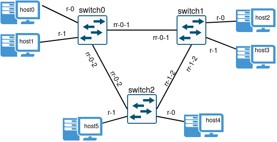
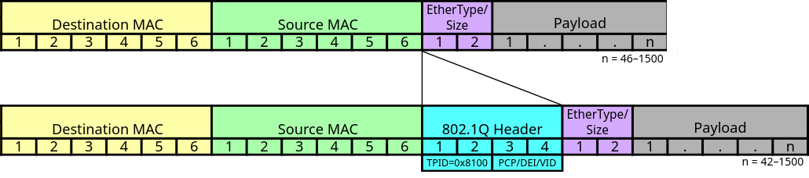
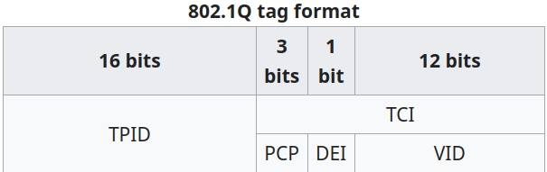

# Switch Protocols

This project implements an Ethernet switch that uses VLAN segmentation for network efficiency, Spanning Tree Protocol (STP) for loop prevention, and MAC address learning for efficient frame forwarding. By dynamically managing VLAN membership, preventing loops, and learning MAC addresses, the implementation ensures reliable communication and facilitates network segmentation for enhanced performance.

<p align="center">
    
</p>

## Frame Forwarding Process

- **Frame Arrival:** An Ethernet frame arrives at a switch through one of its ports.
- **Destination MAC Address Lookup:** The switch examines the destination MAC address (dst) in the Ethernet frame header.
- **MAC Address Table Lookup:** The switch checks its MAC address table to find the port associated with the destination MAC address. If found, the frame is forwarded out of the corresponding port.
- **Unknown Destination MAC Address Handling:** If the MAC address is unknown, the switch floods the frame to all ports except the incoming one to ensure connectivity.
- **Broadcast and Multicast Forwarding:**
  - Broadcast frames are forwarded to all ports except the receiving one, ensuring all devices receive the broadcast.
  - Multicast frames are forwarded only to ports interested in the multicast group.
- **VLAN Considerations:** Frames are forwarded only within the VLAN to which they belong, respecting VLAN membership. Trunk ports carry traffic from multiple VLANs over a single link, using VLAN tagging for differentiation.
- **VLAN Tagging on Trunk Ports:** Trunk ports append VLAN tags to frames, identifying their VLAN membership. VLAN tagging enables logical separation of VLANs over the same physical infrastructure.

## VLAN

VLANs (Virtual Local Area Networks) segment a single physical LAN into multiple broadcast domains. This implementation introduces VLAN tagging and forwards frames based on VLAN membership, facilitating efficient network segmentation and traffic management.

<p align="center">
    
</p>

### VLAN Forwarding Process

- **Frame Reception:** When a switch receives a frame with an unknown destination or broadcast, it forwards it to all ports within the same VLAN, including trunks.
- **IEEE 802.1Q VLAN Tagging:** VLAN tagging is introduced using IEEE 802.1Q, adding 4 bytes to the frame. The VID field (12 bits) represents the VLAN identifier.
- **Switch Behavior:**
  - If on an access port:
    - Forwards with 802.1Q header on trunk interfaces.
    - Forwards without header if VLAN ID matches that of the incoming interface.
  - If on a trunk port:
    - Removes VLAN tag and forwards:
      - With 802.1Q header (including tag) on trunk interfaces.
      - Without header if VLAN ID matches that of the received frame on access interfaces.
- **Linux VLAN Filtering:** To preserve VLAN tags, TPID value of 0x8200 is used instead of 0x8100. PCP and DEI are set to 0.

<p align="center">
    
</p>

- **Trunk Links:** Links between switches operate in trunk mode, allowing passage of all VLANs. The native VLAN is irrelevant.
- **Configuration:** VLANs and trunk configurations are set via a configuration file specified in the API section.

## STP (Spanning Tree Protocol)

STP is a protocol used to prevent loops in network topologies by creating a loop-free logical topology. This implementation provides a simplified version of STP to avoid network loops.

- Each switch initially considers itself as the root bridge and starts with all ports in the Listening state.
- BPDUs (Bridge Protocol Data Units) are exchanged between switches to elect the root bridge and determine the designated ports.
- Trunk ports are crucial for loop prevention, and STP operates only on these ports to avoid potential loops.

### Simplified Algorithm

- **Initialization:** Trunk ports start in the Blocking state to prevent loops. Switches consider themselves as root bridges, with all ports in the Listening state. If a switch believes it's the root bridge, it sets all ports to the Designated Port state.
- **BPDU Exchange:** Switches exchange BPDUs to elect the root bridge and determine designated ports. BPDUs contain root bridge ID, sender bridge ID, and root path cost. BPDUs are regularly sent on trunk ports.
- **Root Bridge Election:** Upon receiving a BPDU, switches compare root bridge IDs. If received ID is lower, the switch updates its information and forwards the BPDU. Switches continuously update root bridge information.
- **Port States:**
  - Ports can be Blocking, Listening, Learning, or Forwarding.
  - Blocking: Disabled to prevent loops.
  - Listening: Open for BPDUs, preparing for Learning state.
  - Learning: Populate MAC address tables but don't forward user data.
  - Forwarding: Fully operational, forward user data.
- **Loop Prevention:** STP operates on trunk ports to prevent loops. BPDUs determine best paths to root bridge and block redundant links.
- **Frame Forwarding:** Switches forward frames based on established spanning tree topology, ensuring a loop-free network.

## Usage

To simulate a virtual network, we will use `Mininet`. Mininet is a network simulator that utilizes real kernel, switch, and application code implementations. Mininet can be used on both Linux and WSL2.

```bash
sudo apt update
sudo apt install mininet openvswitch-testcontroller tshark python3-click python3-scapy xterm python3-pip
sudo pip3 install mininet
```

After installing Mininet, we will use the following command to increase the font size in the terminals we open.

```bash
echo "xterm*font: *-fixed-*-*-*-18-*" >> ~/.Xresources
xrdb -merge ~/.Xresources
```

When running the simulation, you may encounter the following error: `Exception: Please shut down the controller which is running on port 6653:`. To resolve the issue, you will need to run `pkill ovs-test`.
